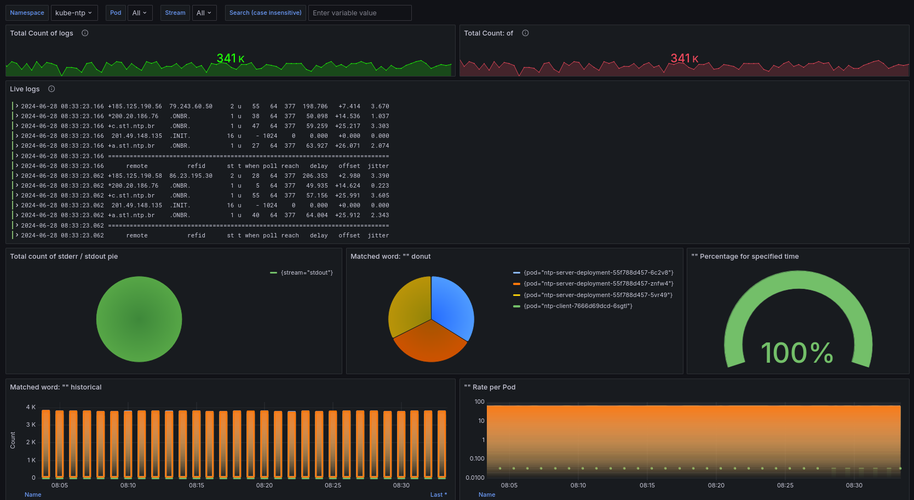

# Kubernetes Loki Stack

## Create Namespace monitoring
```sh
kubectl create ns monitoring
```
## Grafana
Com o Helm instalado utilize os seguintes comandos:
Copie o arquivo values.yaml para o diretorio que irá realizar o comando.

```sh
helm repo add grafana https://grafana.github.io/helm-charts
helm repo update
helm install -n monitoring --values values.yaml grafana grafana/grafana --version 8.0.2 --debug --timeout 10m0s
```

Comando para recuperar a senha padrão de admin
```
kubectl get secret --namespace monitoring grafana -o jsonpath="{.data.admin-password}" | base64 --decode ; echo
```

Após o configurar o loki, adicione o Dashboard.
Dashboard: 16966 Container Log Dashboard
           
</img>

## Loki
Criar o arquivo values.yaml, o arquivo default é criado com o seguinte comando:
```bash
helm show values grafana/loki --version 6.6.3 > values.yaml
```
Com seu editor favorito `vi values.yaml` ou `nano values.yaml`

```bash
helm install -n monitoring --values values.yaml loki grafana/loki --version 6.6.3 --debug --timeout 10m0s
```
> [!IMPORTANT]
> Lembre-se de alterar os valores do values.yaml de acordo com o ambiente, no caso alterei os parametros de chunksCache e memcached.


## Promtail
Nos arquivos Edite o campo:
```yaml
  clients:
    - url: http://{{loki:port}}/loki/api/v1/push
```

Para o endpoint do seu servidor do loki.
```bash
helm install -n monitoring --values values.yaml promtail grafana/promtail --version 6.16.2 --debug --timeout 10m0s
```
